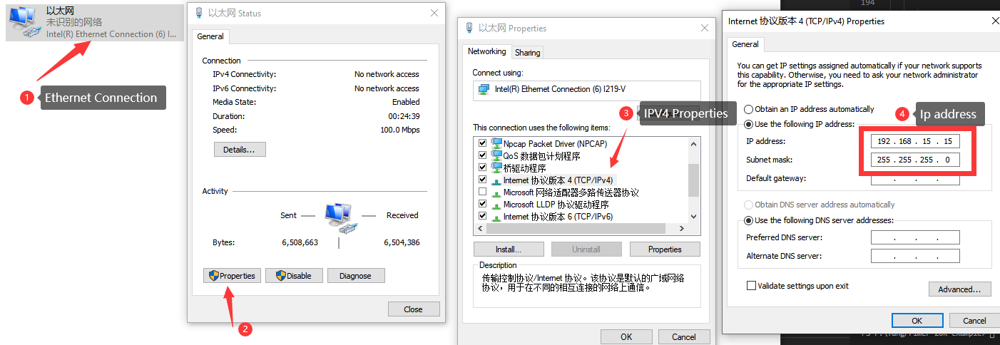
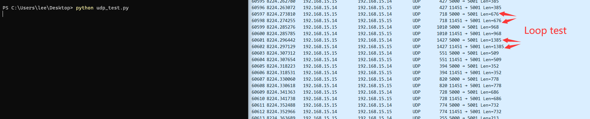

1. Flash `udp_18k.fs` into FPGA Flash.
2. Connect FPGA and computer via Ethernet cable
3. Set the ip `192.168.15.15` (this matches the `MY_IP` parameters in udp_test.py) as following steps.
   
4. Run `python udp_test.py` to test the UDP-loop test.

Because this is only loop test, and it's UDP protocol. It log shows failed, rerun `python udp_test.py` to test again.

If you meet trouble, visit the [author](https://github.com/ZiyangYE/Verilog_TCP)