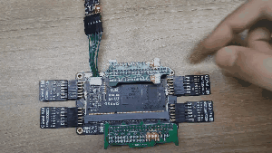
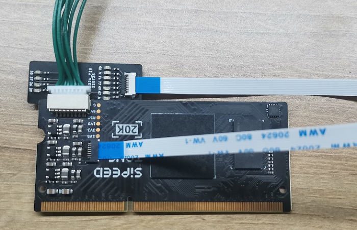

# LicheeTang20K_Lite_factory_test

This project includes [DDR-Test](https://github.com/ZiyangYE/LicheeTang20K_DDR_Test) provided by [ZiyangYE](https://github.com/ZiyangYE) and another IO pin toggle example.

## IO toggle

All usable IO (except JTAG and Reconfig_n pins) toggle.
And after pressing key will change ite frequency.




Besides, Press key marked T2 will make all led IOs low voltage,and Press T10 while T2 is pressing will make all IO toggle again. That two keys are in the top-right.


The following picture shows testing spi connector IO and SD slot IO.




## Serial print

Using serial tool with 115200 baudrates to see the DDR test result.

```text
Perform ResetAuto Reset Every 100s
Init CompleteDDR Size: 1G
Begin to Fill
Fill Stage 1 Finished
Begin to Check Stage 1
Check Stage 1 Finished without Mismatch
Begin to Fill Stage 2
ill Stage 2 Finished
Begin to Check Stage 2
Check Stage 2 Finished without MismatchTest Finished
...
```