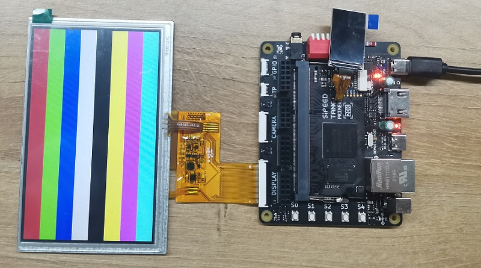

# TangPrimer-20K-example
---
- [TangPrimer-20K-example](#tangprimer-20k-example)
  - [Note](#note)
    - [Error code:RP2017](#error-coderp2017)
  - [Reference](#reference)
    - [Lite-bottom test project](#lite-bottom-test-project)
    - [DDR-Test](#ddr-test)
    - [SPI\_lcd](#spi_lcd)
    - [RBG\_lcd](#rbg_lcd)
    - [Cam2lcd](#cam2lcd)
    - [Micarray](#micarray)
    - [rocket](#rocket)
    - [WS2812](#ws2812)

## Note

### Error code:RP2017

When you meet error code `PR2017`, just enable corresponding IO as regular IO.

Click `Project` in top menu bar and choose `Configuration`, then enable the corresponding Dual Purpose Pin to deal with this error.

## Reference

### [Lite-bottom test project](./Lite-bottom%20test%20project/test_board/README.md)

This is the test project which is used for testing Lite-bottom and core board(Factory test).
Including the DDR-Test project and another demo containing all other usable IO blink.

### [DDR-Test](./DDR-test/LicheeTang20K_DDR_Test/README.md)

Thanks [ZiyangYE](https://github.com/ZiyangYE) providing this example.
Using serial-communication with 115200 baudrates to shows result.

### SPI_lcd

This is an example driving 1.14 inch spi screen.

### RBG_lcd

This example contains 4 kind of different color bar data in source code, this project just use one color bar data for example.

### Cam2lcd

There are 4 projects, their name rules are as followings:

| Folder name | Camera | Screen resolution | Frame storge mode |
| --- | --- | --- | --- |
|OV5640_LCD480_DDR3| OV5640 | 480x272 | DDR3 |
|OV5640_LCD800_DDR3| OV5640 | 800x480 | DDR3 |
|OV5640_LCD480_FIFO| OV5640 | 480x272 | FIFO |
|OV5640_LCD800_FIFO| OV5640 | 800x480 | FIFO |

These are only for testing, and if you want better results, you need program on yourself.

After burning the .fs bitstream into fpga, press `S0` button to reset to get right display.

### Micarray

There is demo for micarray board.

### [rocket](./rocket/README.md)

This runs a `rv32ic` rocket core with a UART peripheral attached. This example system outputs `A` via UART infinitely.

### WS2812

A demo for onboard ws2812 led.