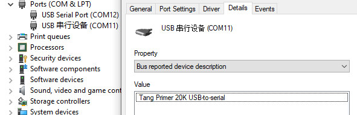
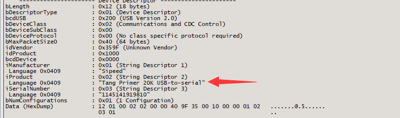

# USB Demo

## usb_serial pool

Burn into primer 20K, and connect the USB OTG port with computer, a COM port is shown in computer.

If you enter any character in this serial terminal, it will display on this terminal.